# pdefourier: A package for doing Fourier analysis and solving partial differential equations in Maxima CAS #

Fourier analysis provides a set of techniques for solving partial differential equations (PDEs) in both bounded and unbounded domains, and various types of initial conditions. In the bounded domain case, the method of separation of variables leads to a well-defined algorithm for developing the solution in a Fourier series, making this problem tractable with a CAS.

##### Table of Contents  
[Overview](#overview)         
[Installation](#installation)            
[Fourier coefficients and series](#foucoeff)                
[Frequency spectrum](#frequency)            
[The heat equation](#heat)           
[The wave equation](#wave)         
[The Laplace equation](#laplace)        
[Bessel functions](#bessel)         

## <a name="overview">Overview<a/> ##

This Maxima package computes symbolically the Fourier of piecewise-smooth functions. Using the method of separation of variables it is also able to symbolically solve the one-dimensional heat and wave equations on a domain [0,L], with regular
Sturm-Liouville conditions, that is, general boundary conditions of the form:

&alpha;1u(0,t) + &beta;1ux(0,t) = h1(t)  
&alpha;2u(L,t) + &beta;2ux(L,t) = h2(t)

Moreover, the package can solve the two-dimensional Laplace equation for a variety of domains (rectangles, disks, annuli, wedges) either with Dirichlet or Neumann boundary conditions. In the case of a rectangular domain [0,a] x [0,b], the package can solve the Laplace equation with mixed boundary conditions of the form

(1-&alpha;)u(x,0) + &alpha;uy(x,0) = f0(x), 0 &le; x &le; a 
(1-&beta;)u(x,b) + &beta;uy(x,b) = fb(x), 0 &le; x &le; a 
(1-&gamma;)u(0,y) + &gamma;ux(0,y) = g0(y), 0 &le; y &le; b 
(1-&delta;)u(a,y) + &delta;ux(a,y) = ga(y), 0 &le; y &le; b 

where &alpha;,&beta;,&gamma;,&delta; &isin; {0,1}.

Of course, in all cases it is possible to truncate a series to make numerical calculations.

**Remark**: `pdefourier` automatically loads other packages, including `piecewise`, `draw`, `simplify_sum`, and `syntactic_factor`. The Maxima package `syntactic_factor` was written by Stavros Macrackis. Currently, `pdefourier` loads the files `piecewise` and `syntactic_factor` contained in this repository.

The [Documentation folder](doc) folder contains a [pdf file](doc/pdefourier-examples.pdf) explaining some technical details
of the implementation and a description of many of the functions contained in the package, as well as their syntax. Also, there is a [Maxima session](doc/Documentation-pdefourier.wxm) (in wxm format) with lots of examples, graphics, animations and tips for use.
Here, we only give a quick introduction to the main commands used for solving typical problems.

## <a name="installation">Installation<a/> ##

The package can be installed by putting a copy of the files `pdefourier.mac`, `syntactic_factor.mac`, and `piecewise.mac`
inside a folder contained in the
environment variable `file_search_maxima`. In a Linux box, such a system-wide location could be something like
`/usr/share/maxima/5.42.2/share/contrib/`, while
in a Windows environment typically it will be
`c:\Program files (x86)\Maxima-sbcl-5.42.0/share/maxima/5.42.0/share/contrib`
(you may  need  administrator  rights  in  order  to  do  that in either case). The
package can then be loaded  with the command `load(pdefourier)` inside a Maxima session.

## <a name="foucoeff">Fourier coefficients and series<a/> ##

The package can deal with piecewise functions, defined in natural notation:

<code>(%i1)	load("pdefourier.mac")$ </code> 
<code>(%i2)	v(x):=if (-%pi<=x and x<0) then x^2 elseif (0<=x and x<=%pi) then sin(3*x)$</code>

It is possible to detect the parity of such a functions, with `paritycheck`; possible outcomes are `even`, `odd` or `none`:

<code>(%i3)	paritycheck(v(x),x);</code> 
<code>(%i2)	none</code>

Let us draw the curve to chek the answer:

<code>(%i4)	plot2d(v(x),[x,-%pi,%pi],[ylabel,"v(x)"]);</code> 
<code>(%t4)</code>

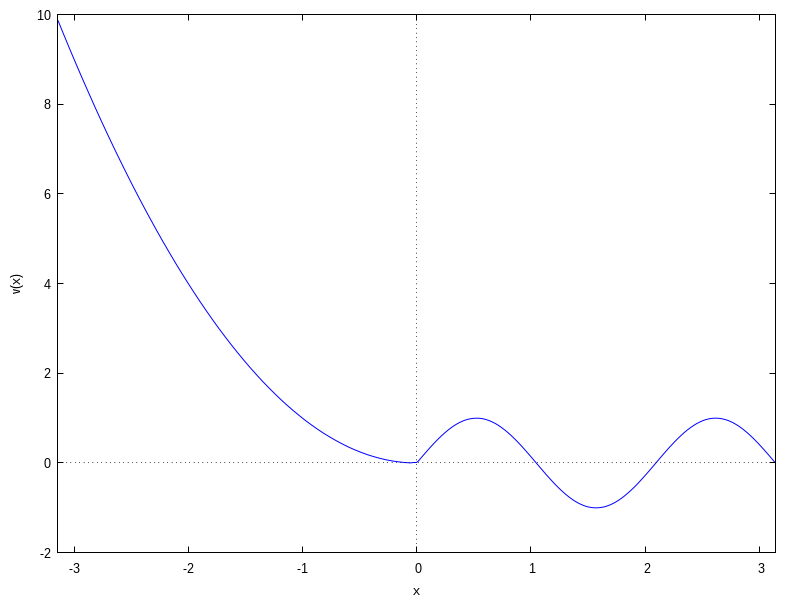

The Fourier coefficients are computed with `fouriercoeff`, whose syntax is

<code>fouriercoeff(expr,var,p)</code>

Here `p=(b-a)/2` if the whole interval of definition for `expr` is [a,b]. The output has the form

	<code>[[a0,an,bn],svlist]</code>

where `svlist` is a sublist containing the singular values of the coefficients, again with the format

	<code>[m,am,bm]</code>

In the example we are considering,
notice that the function is defined on [-&pi;&pi;]:

<code>(%i5)	fouriercoeff(v(x),x,%pi);</code> 
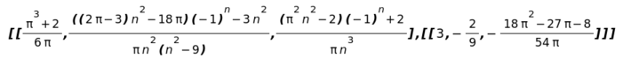

This example illustrates the presence of singular values of the coefficients (for n=3). We can approximate the function by its Fourier series truncated to order 15:

<code>(%i6)	vseries15:fourier_series(v(x),x,%pi,15)$</code> 
<code>(%i7)	wxplot2d([v(x),vseries15],[x,-%pi,%pi],[legend,false]);</code> 
<code>(%t7)	</code>

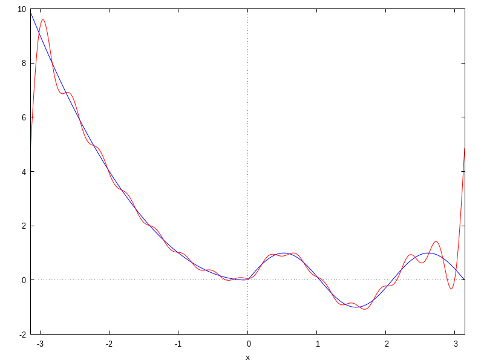

Here is a well-known example of an unbounded function:

<code>(%i8)	absolute(x):=if (x<=0) then -x elseif (x>0) then x$</code> 
<code>(%i9)	paritycheck(absolute(x),x);</code> 
<code>(%o9)	even</code>

and its bounded version, for which we compute the Fourier series:

<code>(%i10)	absolute0(x):=if ( x>=-1 and x<=0) then -x elseif (x>0 and x<=1) then x$</code> 
<code>(%i11)	paritycheck(absolute0(x),x);</code> 
<code>(%o11)	even</code> 
<code>(%i12)	fourier_series(absolute0(x),x,1,inf);</code> 

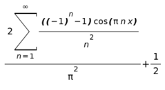

## <a name="frequency">Frequency spectrum<a/> ##

Frequency analysis is very useful in Engineering applications (but also in Physics). This technique
requires that the Fourier series be first re-expressed using the identity

                                        a cos(w)+b sin(w)=r cos(w-u)

where the modulus and the phase shift are given, respectively, by r=sqrt(a2+b2) and
u=atan(b/a). Then, we can rewrite the terms of the series in the so-called harmonic form:

	cn cos(nwx-un)

In the theory of sound, the first harmonic (corresponding to n=1) is called the fundamental
harmonic. The remaining ones are called overtones. The coefficients cn are the harmonic
amplitudes, and the absolute value |cn| is a measure of the relative importance of the nth
harmonic in a given signal (sound).
The frequency analysis is done in `pdefourier` with the aid of the function
`fourier_freq`. The function `fourier_harm` returns a list with the first n harmonics of a given function,
with the syntax

<code>fourier_harm(function(variable),variable,p,n)</code>

where p=(b-a)/2 and [a,b] is the interval of definition of the function, while `fourier_freq_list`
(with the same syntax) gives the list of the amplitudes.

Here is the example of the square pulse with compact support on [-2,2]:

<code>(%i1)	load(pdefourier)$</code> 
<code>(%i2)	square0(x):=if (-2<=x and x<-1) then 0 elseif (-1<=x and x<=1) then 1 elseif (1 < x and x< =2) then 0$</code> 
<code>(%i3)	plot2d(square0(x),[x,-2,2],[y,-0.1,1.1],[ylabel,"square pulse"]);</code> 
<code>(%t3)	</code>

<code>(%i4)	fourier_harm(square0(x),x,2,5);</code> 

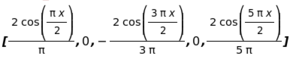

<code>(%i5)	fourier_freq_list(square0(x),x,2,5);</code> 
<code>(%o5)	[[1.0,0.6366197723675814],[2.0,0.0],[3.0,0.2122065907891938],[4.0,0.0],[5.0,0.1273239544735163]]</code> 

For smooth or mildly non-smooth functions, the Fourier series converges very fast, and so the first
few terms  suffice to get a good approximation. This is reflected in the relative weight of each
harmonic (fastly decreasing), and can be visualized (using the wxMaxima frontend) with the
command  `wxfourier_freq`:

<code>(%i6)	wxfourier_freq(square0(x),x,2,10);</code> 
<code>(%t6)	</code>

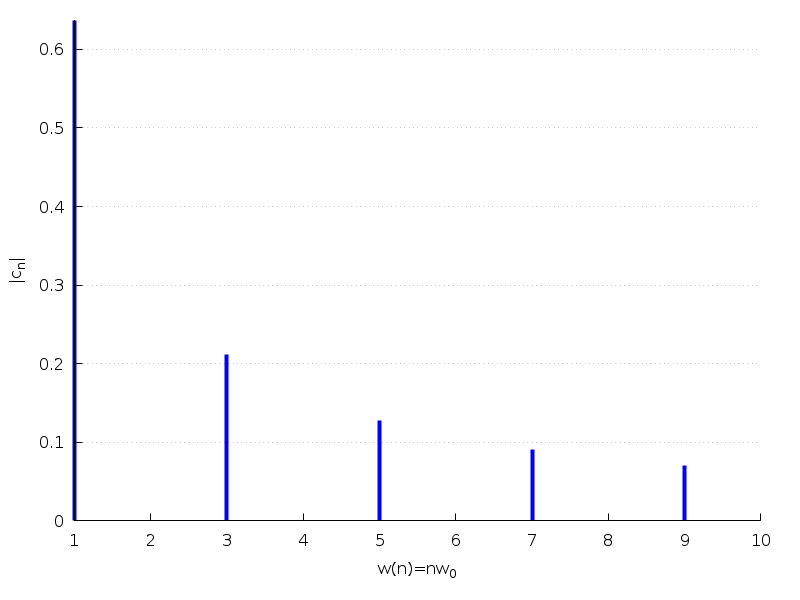

For very discontinous functions, the amplitude of harmonics does not decrease that fast
(or does not decrease at all). Consider the following function as an example:

<code>(%i7)	f0(x):=if (x>=-4 and x<-3 ) then 0 elseif (-3<=x and x<=-2) then 1 elseif (-2<x and x<-1) then 0
elseif (-1<=x and x<=1) then -x elseif (1<=x and x<=2) then 0
elseif (2<x and x<3) then -1 elseif (x>=3 and x<=4) then 0$</code>

Here is its graphical representation, along with its Fourier approximation up to order 15:

<code>(%i8)	seriesf0:fourier_series(f0(x),x,4,15)$</code> 
<code>(%i9)	plot2d([f0(x),seriesf0],[x,-4,4],[legend,false]);</code> 
<code>(%t9)	</code>

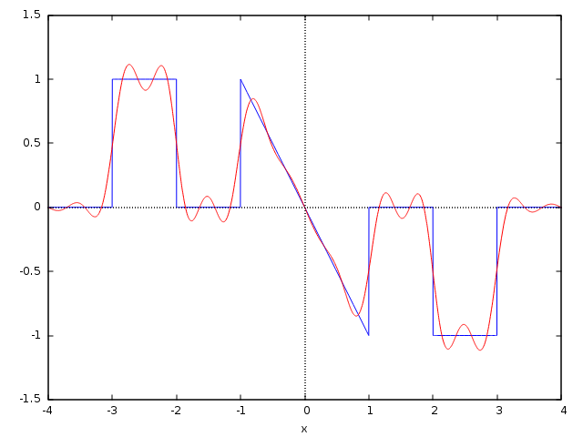

And its frequency spectrum (containing the first 10 harmonics):

<code>(%i10)	wxfourier_freq(f0(x),x,4,10);</code> 
<code>(%t10)	</code>

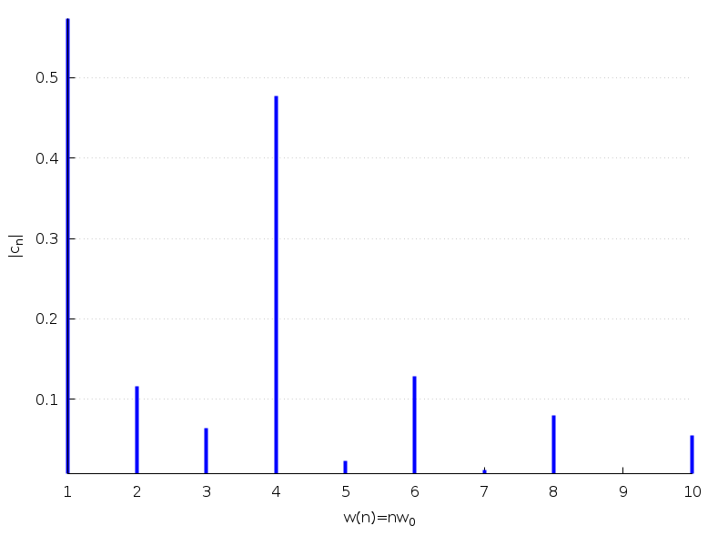

Finally, notice that adding terms to the Fourier series reflects in the harmonic content of the signal,
as the following animation shows (this too requires the wxMaxima frontend):

<code>(%i11)	ramp(x):=if (-5<=x and x<=-1) then (x+3)/2 else 0$</code> 
<code>(%i12)	define(ramp_series(x,n),fourier_series(ramp(x),x,2,n))$</code>
<code><pre>(%i13)	with_slider_draw(k,makelist(j,j,1,10),
    dimensions=[900,450],
    xrange=[-5.25,10.25],
    yrange_secondary=[-1.45,1.45],
    axis_top=false,
    axis_left=false,
    xtics=none,
    user_preamble=["set y2label tc rgb 'blue'","set ylabel tc rgb 'red'","set grid y2"],
    yaxis=false,
    ytics=none,
    yaxis_secondary=true,
    ylabel_secondary="|c_n|",
    ytics_secondary=auto,
      color=blue,
      label(["w(n)=nw_0",5,-0.25]),
      points_joined=impulses,line_width=4,color=blue,
      points(fourier_freq_list(ramp(x),x,2,k)),
      line_width=1,
      color=violet,
      key="ramp(x)",key_pos=top_left,
      explicit(ramp(x),x,-5,-1),
      line_width=2,
      key="Fourier series",
      color=red,explicit(ramp_series(x,k),x,-5,-1)
    ),wxplot_size=[900,450];</pre></code>
<code>(%t13)</code>

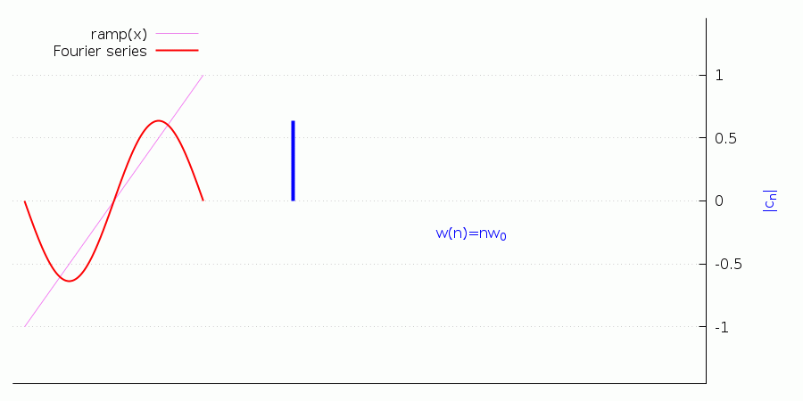

## <a name="heat">The heat equation<a/> ##

The general Sturm-Liouville problem for the heat equation can be expressed as

 ut(x,t)-&kappa;uxx(x,t)=Q(x,t) with (x,t) &isin; [0,L]x&#x211d;+ 
u(x,0)=F(x)  
&alpha;1u(0,t) + &beta;1ux(0,t) = h1(t)  
&alpha;2u(L,t) + &beta;2ux(L,t) = h2(t)

This is a problem involving mixed initial and boundary conditions. The command we use in this case is `mixed_heat`, with syntax

<code>
 mixed_heat(Q(x),F(x),&alpha;1,&beta;1,&alpha;2,&beta;2,h1(tvar),h2(tvar),xvar,tvar,L,&kappa;,ord)</code>

where `ord` can be `inf` or a positive integer. In the first case, the solution is given in the form of a Fourier series;
in the second, as a series truncated to order `ord`.

**Example 1** Consider the problem

 ut-&kappa; uxx=0, x&isin;[0,L], t>0  
 u(x,0)=1-x3/4 
 ux(0,t)=0 
 ux(1,t)=-u(1,t) 

Physically, it corresponds to the heat propagation in a bar where the left end is insulated, and
the right end has convection heat loss.

We solve it with the following commands:

<code>(%i1)	load(pdefourier)$</code> 
<code>(%i2)	Q(x,t):=if (0<=x and x<=1) then 0$</code> 
<code>(%i3)	F(x):=if (0<=x and x<=1) then 1-x^3/4$</code> 
<code>(%i4)	h1(t):=0$</code> 
<code>(%i5)	h2(t):=0$</code> 
<code>(%i6)	mixed_heat(Q(x,t),F(x),0,1,1,1,h1(t),h2(t),x,t,1,k,inf);</code> 
<code>(%o6)	%lambda[n] are the solutions of %lambda[n]*cos(%lambda[n])-%lambda[n]^2*sin(%lambda[n])=0</code> 

<code>(%i7)	kill(Q,F,h1,h2)$</code> 

## <a name="wave">The wave equation<a/> ##

Consider now the general Sturm-Liouville problem for the wave equation:

 utt=c2 uxx+T(x,t) with (x,t) &isin; [0,L]x&#x211d;+ 
u(x,0)=f(x)  
 ut(x,0)=g(x)  
&alpha;1u(0,t) + &beta;1ux(0,t) = b1(t)  
&alpha;2u(L,t) + &beta;2ux(L,t) = b2(t)

The command in this case is `mixed_wave`, with syntax

<code>
 mixed_wave(T(x,t),f(x),g(x),&alpha;1,&beta;1,&alpha;2,&beta;2,b1(tvar),b2(tvar),xvar,tvar,L,c,ord)</code>

**Example 2** Consider the following problem for the wave equation in (x,t)&isin;[0,L] x [0,&infin;[:

 utt=c2 uxx+ax  
 u(L,0)=0=u(0,t) 
 ux(0,t)=0 
 ut(x,0)=0=u(x,0) 

This is Example 4.31 in J. D. Logan's ''Applied Partial Differential Equations'' (3rd. Ed.), Springer Verlag, 2015.
The following Maxima session solves it (notice we are assuming that `load(pdefourier)` has been already executed!):

<code>(%i8)	assume(t>0)$</code> 
<code>(%i9)	assume(L>0)$</code> 
<code>(%i10)	T(x,t):=if (0<=x and x<=L) then a*x$</code> 
<code>(%i11)	f(x):=if (0<=x and x<=L) then 0$</code> 
<code>(%i12)	g(x):=if (0<=x and x<=L) then 0$</code> 
<code>(%i13)	bb1(t):=0$</code> 
<code>(%i14)	bb2(t):=0$</code> 
<code>(%i15)	mixed_wave(T(x,t),f(x),g(x),1,0,1,0,bb1(t),bb2(t),x,t,L,c,inf);</code> 
<code>(%o15)</code> 

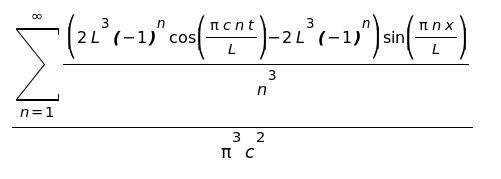

We can simplify the output a little bit:

<code>(%i16)	factor(%);</code> 
<code>(%o16)</code> 

Mathematica&trade; (version 12.0) can not solve it, but Maple&trade; (version 2019) does. In case you want to compare the output
given here with that of Maple&trade;'s, please notice that

<code>(%i17)	fouriersin_series((a*L^2*x-a*x^3)/6,x,L,inf);</code> 
<code>(%o17)</code>

<code>(%i18)	kill(T,f,g,bb1,bb2)$</code> 

## <a name="laplace">The Laplace equation<a/> ##

The 2D Laplace equation &Delta;u=0 can be written either in Cartesian coordinates

 &Delta;u=uxx+uyy=0

or in polar ones

 &Delta;u=urr+1&frasl;r&nbsp;ur+1&frasl;r2&nbsp;u&theta;&theta;=0

These can be used in conjunction with Dirichlet or Neumann conditions, on a variety of domains. Accordingly, `pdefourier`
offers several commands: `dirichlet_laplace_rectangle`, `neumann_laplace_rectangle`, `dirichlet_laplace_disk`, `neumann_laplace_disk`, `dirichlet_laplace_wedge`, `neumann_laplace_wedge`, `dirichlet_laplace_annulus`, and `neumann_laplace_annulus`. We refer to the [pdf documentation file](doc/pdefourier-examples.pdf) for more details
and examples of each case.

 **Example 3** The following is a  Neumann problem for the Laplace equation on a wedge defined by 0<&theta;<&pi;/2, 0<r<1:

 &Delta;u=0  
 u(r,0)=0=u(r,a)  
 ur(&theta;,r)= cos(4&theta;) 

The solution is readily found:

<code>(%i19)	ur(theta):= if (0<=theta and theta<=%pi/2) then cos(4*theta)$</code> 
<code>(%i20)	neumann_laplace_wedge(R,%pi/2,ur(theta),theta,inf);</code> 
<code>(%o20) The sum is over &#x2115;-{2}</code> 

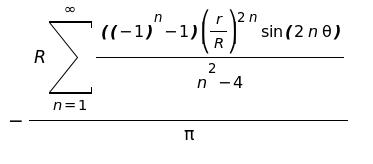

To get a graphical representation of the solution, we can truncate the resulting series:

<code>(%i21)	expr:neumann_laplace_wedge(1,%pi/2,ur(theta),theta,15)$</code> 
<code>(%i22)	u_r1:at(diff(expr,r),r=1)$</code> 
<code>(%i23)	draw3d(view=[67,151],surface_hide = true,</code> 
<code>	       color = orange,</code> 
<code>	       parametric_surface(r*cos(theta),r*sin(theta),expr,r,0,1,theta,0,%pi/2),</code> 
<code>	       line_width  = 3,</code> 
<code>	       color = blue,</code> 
<code>	       parametric(t,0,0,t,0,1),</code> 
<code>	       color = blue,</code> 
<code>	       parametric(0,t,0,t,0,1)</code> 
<code>	)$</code> 
<code>(%t23)</code> 

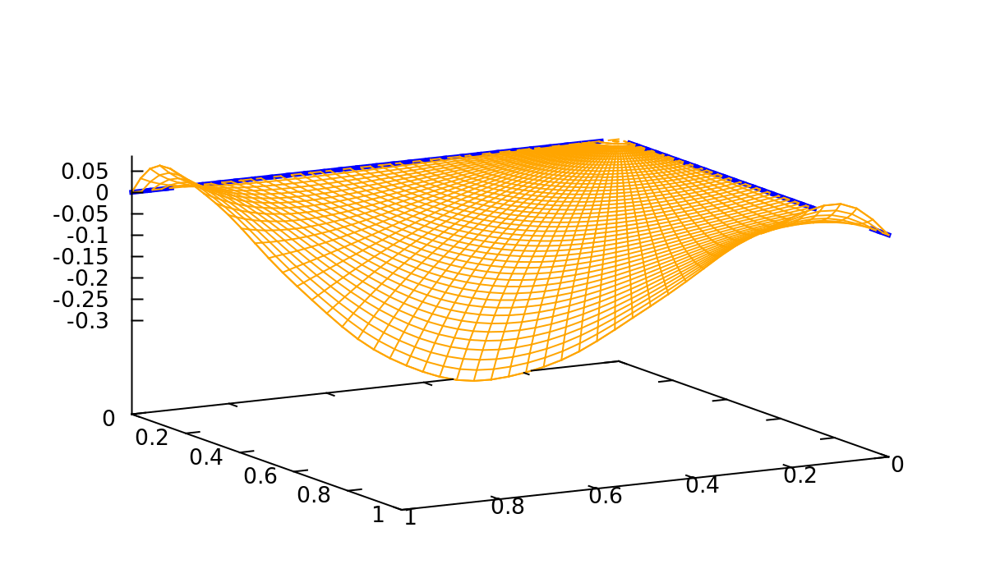

## <a name="bessel">Bessel functions<a/> ##

Maxima has built-in functions for computing values of the Bessel functions, but not of their zeros.
These zeros are needed for solving some problems, notably the 2D wave equation on bounded domains.
The package `pdefourier` implements a fast and efficient algorithm for this task, the command
`BesselJZeros` calculates the zeros of Bessel functions of the first kind J&nu;(x)
when &nu;>-1. Thus, the 5th zero of J4(x) is given by

<code>(%i24)	BesselJZeros(4,5);</code> 
<code>(%o24)	20.82693295696241</code>

while the first five zeros of J4(x) are obtained using the optional argument `all`:

<code>(%i25)	BesselJZeros(4,5,all);</code> 
<code>(%o25)	[7.5883424345038,11.06470948850117,14.37253667161759,17.61596604980481,20.82693295696241]</code>

There is no upper bound in the order (although precision decreases with higher values of &nu;). Many
algorithms use some variant of MacMahon's formula or the Halley method, so they are not capable of working with
big values. For instance, neither Mathematica(TM) nor Wolfram Alpha can compute this:

<code>(%i26)	BesselJZeros(146225,3);</code> 
<code>(%o26)	146456.0070601201</code>

The zeros of the derivatives of first-order Bessel functions can be computed with the aid of
formulas such as

 J'0(z)=-J1(z) 
 J'&nu;(z)=(J&nu;-1(z)-J&nu;+1(z))/2

In this case, we have the command `BesselJdiffZeros`. For instance, the following table gives the first 5
zeros of J'm(x) for 0&le;m&le;10, and is to be compared with the one in
http://wwwal.kuicr.kyoto-u.ac.jp/www/accelerator/a4/besselroot.htmlx

<code>(%i27)	apply(matrix,makelist(BesselJdiffZeros(j,5,all),j,0,10));</code> 
<code>(%o27)</code> 
	<code>
		[3.831705970207512,7.015586669815619,10.17346813506272,	13.32369193631421,16.47063005087759],
		[1.84118378134066,5.331442773525031,8.536316366346284,11.70600490259207,14.86358863390901],
		[3.05423692822714,6.706133194158456,9.96946782308759,13.17037085601612,16.34752231832178],
		[4.201188941210528,8.015236598375953,11.345924310743,14.58584828616704,17.78874786606648],
		[5.317553126083997,9.28239628524161,12.68190844263889,15.96410703773154,19.19602880004888],
		[6.41561637570024,10.51986087377231,13.98718863014031,17.31284248788464,20.57551452138685],
		[7.501266144684142,11.7349359530427,15.26818146109787,18.6374430096662,21.93171501780223],
		[8.577836489714077,12.93238623708957,16.52936588436695,19.94185336652735,23.26805292645757],
		[9.647421651997215,14.11551890789461,17.77401236691525,21.22906262285313,24.58719748631768],
		[10.71143397069994,15.28673766733295,19.00459353794605,22.50139872677729,25.89127727683913],
		[11.77087667495558,16.4478527484865,20.22303141268171,23.76071586032743,27.18202152719051]
	</code>

As an application, consider the 2D wave equation (with c2=5):

	utt=5(uxx+uyy)

on the rectangle (x,y)&isin;[0,4]x[0,2], with intial configuration f(x,y)=x(4-x)y(2-y)/10 and vanishing initial
distribution of velocities. We solve that problem and create an animation of the solution with the following commands:

<code>(%i28)	f(x,y):=x*(4-x)*y*(2-y)/10$</code> 
<code>(%i29)	g(x,y):=0$</code> 
<code>(%i30)	wave2d_rectangle(sqrt(5),4,2,f,g,4,4)$</code> 
<code>(%i31)	expr:%$</code> 
<code>(%i32)	wxanimate_draw3d(s,makelist(i/10,i,0,32),
   surface_hide=true,zrange=[-1.5,1.5],
   color=orange,
   parametric_surface(x,y,subst(t=s,expre),x,0,4,y,0,2)
),wxanimate_framerate=8$</code> 
<code>(%t28)</code>

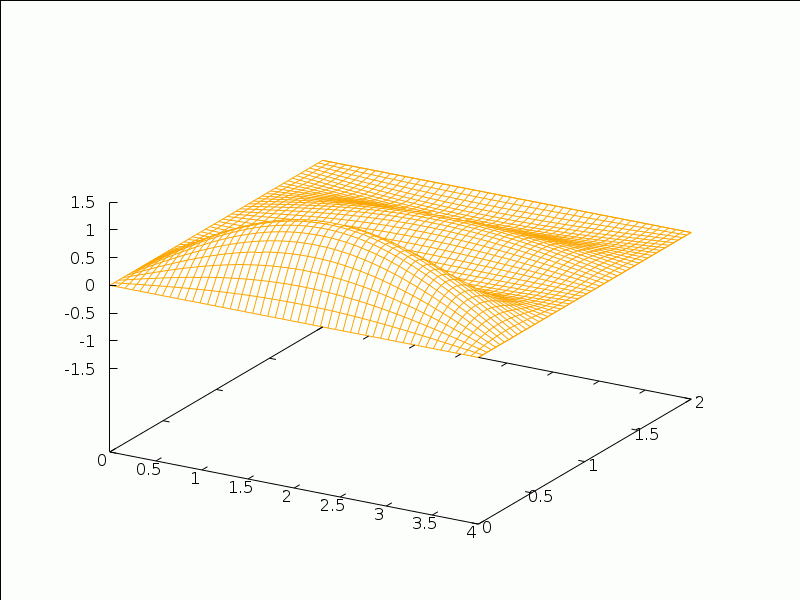

## Software used

* [Maxima](http://maxima.sourceforge.net/) - Maxima, a computer algebra system
* [wxMaxima](https://wxmaxima-developers.github.io/wxmaxima/) - wxMaxima, a graphical front-end for Maxima

## Authors

* **Emmanuel Roque Jim&eacute;nez** - [emmanuelroque](https://github.com/emmanuelroque)
* **Jos&eacute; Antonio Vallejo Rodr&iacute;guez** - [josanvallejo](http://galia.fc.uaslp.mx/~jvallejo)

## License

This project is licensed under the GNU General Public License v3.0 - see the [LICENSE.md](LICENSE.md) file for details

## Acknowledgments

* Thanks to the Maxima's developers team, for maintaining such a wonderful software
* Thanks to the [KeTCindy](https://ctan.org/pkg/ketcindy) team, particularly its main developer Setsuo Takato, for their support
